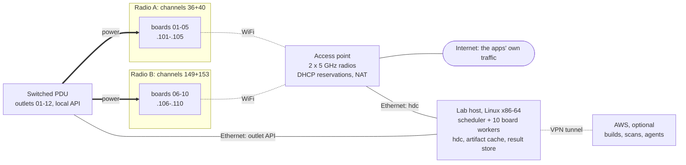

# D600 fleet plan

*[中文版](D600-FLEET-PLAN.zh-CN.md)*

Ten D600 boards on an isolated WiFi network, one IP-switched outlet per board, and one Linux host
that schedules launches across all of them. The point is more validation rounds for the gap map: a
full 329-app round in under an hour instead of 12 hours on one board.

Status: proposal, 2026-10-04. The figures come from the current board and the r84 and r85 runs
(see [Measurements](#measurements)).

## Decisions

1. **Control the boards over WiFi** on an isolated access point with two 5 GHz radios. Each board
   gets a fixed address by DHCP reservation.
2. **Give every board its own switched outlet.** Unplugging powers a D600 off (its battery is a
   dummy), so switching the outlet is a full hard reset.
3. **Stop re-sending the same 208 MB on every launch** (work item S1). That removes most of the
   speed difference between WiFi and USB.
4. **Drive the boards from a native Linux x86-64 host** instead of WSL. Builds can move to AWS later.
5. **Prove it on two boards first.** Buy the other eight once the pilot gates pass.

**Why not USB.** The board's only USB-C port carries both its power and its data. On a USB hub,
each port would have to power its board and switch on and off by itself to keep per-board resets;
a switched outlet would reset a whole hub. USB is the fallback if WiFi fails the pilot.

## Expected throughput

Each column adds one change to the one before it.

| | Today | + input cache (S1) | + Linux host (S3) | 10 boards |
|---|---:|---:|---:|---:|
| Time per launch | ~131 s | ~96 s | ~82 s | ~82–85 s each |
| Launches per hour | 27 | 37 | 44 | ~420 |
| Full 329-app round | 11.9 h | 8.8 h | 7.5 h | ~45–50 min |

The 45 s of fixed observation waits in each launch (12 + 30 + 3 s) stay as they are, because they
are part of what the harness observes. After S1, ten boards ask the WiFi for about 5–6 MB/s in total.
One 40 MHz channel carries roughly 12–17 MB/s for these single-antenna clients. Without S1 they
would ask for about 16 MB/s and saturate a channel.

## Topology

Boards 01–05 use radio A and 06–10 use radio B, so a radio fault stops half the fleet. hdc traffic
stays on the lab LAN. The apps' own traffic leaves through the access point's NAT. Addresses are
examples in a private range.

## Hardware

Buy the pilot set first: the access point, one PDU, the lab host, and one more D600 with its charger.

| Item | Qty | Requirement | Why |
|---|---:|---|---|
| D600 boards | 10 + 1 spare | Same OpenHarmony image as the current board, which serves as the reference | Every launch hash-checks 47 system libraries and refuses a board whose firmware differs |
| USB-C PD chargers | 11 | Same model as today's; 5 V / 3 A or more | The board's only power input |
| USB-C cables | 11 + spares | Short, rated for 3 A | Weak cables brown out a board with no real battery |
| Switched PDU or IP power strip | 12+ outlets | Each outlet switched separately; local HTTP, SNMP or SSH API with no cloud account; room for plug-in chargers (two 8-outlet units work) | Hard reset per board |
| Access point / router | 1 | Two independent 5 GHz radios (tri-band), or two dual-band APs; fixed channels; DHCP reservations; NAT uplink; wired LAN ports | Isolated network with two channels |
| Lab host | 1 | Linux x86-64, gigabit Ethernet. Builds on AWS: 8 cores, 32 GB RAM, 1 TB NVMe. Builds local: 16+ cores, 128 GB RAM, 2 TB NVMe | The toolchain (OH SDK clang, host dex2oat, Linux hdc) is x86-64 Linux |
| Small gigabit switch | 1 | Only if the AP lacks enough LAN ports | Host, PDUs and AP on one wired LAN |
| Shelf and fan | 1 | Space between boards, steady airflow | Boards run all day with screens on; heat would change launch timings |
| UPS (optional) | 1 | About 200 W for host, AP, PDUs and boards | Without real batteries, a power blip reboots all ten boards at once |

## Network and addresses

| Device | Address (example) | Link | How it's fixed |
|---|---|---|---|
| Access point / gateway | 192.168.60.1 | — | Static; runs DHCP for the lab |
| Lab host | 192.168.60.10 | Ethernet | Static |
| PDU 1 / PDU 2 | .11 / .12 | Ethernet | Static; outlets 01–08 and 09–16 |
| Boards 01–05 | .101–.105 | Radio A, channels 36+40 | DHCP reservation by WiFi MAC; outlet number = board number |
| Boards 06–10 | .106–.110 | Radio B, channels 149+153 | Same |
| Spare boards | .111+ | Either radio | Same |

Access point settings:

- One SSID per 5 GHz radio, so each board always lands on the same channel. Turn off band steering
  and roaming features.
- Fixed 40 MHz channels outside the radar-detection (DFS) range: 36+40 and 149+153. The boards' CN
  country code allows both. A radar event on a DFS channel forces a channel change that drops every
  board on it.
- Try 80 MHz in the pilot. Keep it only if the board links faster than today's 200 Mbit/s.
- WPA2 or WPA3 personal. No 2.4 GHz for these SSIDs.
- DHCP reservations by MAC with long leases. If OpenHarmony gives the network a randomized MAC,
  switch that network to the device MAC, or set a static IP on the board.
- The wired lab host must reach every board. Boards don't need to reach each other.
- NAT uplink to the internet for the apps' traffic. Don't expose the lab subnet to the office
  network.
- The hdc TCP port is the same on every board. Only the address differs.

## Power control

- One outlet per board charger. The outlet number equals the board number. Label the board, charger
  and cable at both ends.
- Put the lab host, AP, switch and the PDUs themselves on unswitched power or the UPS. The
  automation never controls an outlet that feeds its own network path.
- A hard reset is outlet off for at least 10 s, then on. The board then boots, rejoins WiFi and comes
  back on hdc.
- Reboot over hdc first whenever hdc still answers. A power cut is for unresponsive boards, since
  cutting power mid-write risks the board's `/data`.
- **Pilot gate:** a board must boot by itself when power returns, without a button press. If it
  doesn't, the fix is a relay across the power key or a vendor boot setting.

## Lab host and AWS

Lab host:

- Native Linux (an Ubuntu LTS release) on x86-64, wired to the lab LAN.
- Use the Linux hdc from the OH SDK (version 3.2.0c). Test it against the boards first: the Windows
  client in use today is 2.0.0a.
- Runs the scheduler, the ten board workers, the artifact cache (framework stages, shims, overrides,
  ~11 GB of APK inputs), the result store and the harness.
- It retires WSL for board control. That removes about 146 ms per hdc call, the Windows-path
  workaround for file receives, the interop drops and the machine-check crashes.

AWS, when approved:

- An x86-64 instance (c7i or c7a class): 32–64 vCPUs, 128 GB RAM, 1–2 TB disk. Spot instances for
  one-off big builds.
- Use the same absolute source path as the current build host. Recorded build commands and the
  natives build depend on it.
- Sync about 37 GB once: workspace, build outputs, corpus APKs. Keep the APKs in a private bucket.
  The private repos need deploy keys.
- Build artifacts come down to the lab host once per build. Results go up continuously, a few MB per
  launch. Use a WireGuard or Tailscale tunnel.
- Before moving builds over, prove the server matches: rebuild the shim and the framework jars and
  compare SHA-256 with the local builds.
- Agents run next to the queue and result store: on the lab host at first, on AWS once builds move
  there.

## Software work

S1 and S2 start after r85 finishes, since the launch scripts are not edited while a run uses them.

| ID | Change | Gain | Effort | Needs |
|---|---|---|---|---|
| S1 | Keep the WebView files (185 MB) and runtime overrides (23 MB) in a content-addressed cache on each board, and copy them into each launch on the board. Launch cleanup leaves the cache alone; the disk guard prunes old entries. The launch still verifies every file's hash. | −30–35 s per launch; 10-board WiFi demand falls from ~16 to ~5–6 MB/s | 0.5–1 day | r85 done |
| S2 | Per-board isolation: per-board staging directories instead of the fixed `rg.jpeg`, `ev.*` and `ev-libs.tar` paths; board id in output dirs and logs; per-board locks instead of `pgrep` waits; board settings read from the inventory. | Parallel runs don't collide | 1 day | — |
| S3 | Switch to the Linux hdc. Drop `hdc.exe`, the Windows-path receives and the WSL interop retries. | −14 s per launch | 0.5 day | Lab host |
| S4 | Fleet inventory (`fleet.json`), PDU driver, health checks and the recovery ladder. | Recovery without a person | 1–1.5 days | PDU model |
| S5 | Scheduler and result store: SQLite job queue with lanes and priorities; one worker per board. Infrastructure failures are requeued on another board and never recorded as app results. Results are immutable, keyed by app, configuration hash, board and run. | Ten boards act as one | 2–3 days | S2, S4 |
| S6 | Multi-board deploy: build once, push each build's ~68 MB delta to every board in parallel, keep the promoted build plus one or two candidates staged on each board. | A new build on all boards in minutes | 0.5–1 day | S5 |
| S7 | Parity and drift checks: firmware fingerprint at provisioning and nightly; a ~30-app calibration set on every board each round; flag a board whose results diverge; board id in harness records. | Board differences can't pass as app results | 1 day | S5 |
| S8 | Findings ledger with leases; one coordinator agent plus 3–5 investigator agents on top of the scheduler. | Parallel investigation without duplicate work | 2 days | S5, S7 |
| S9 | AWS bootstrap script and the equivalence check. | Builds and scans off the lab host | 1 day + sync | AWS access |

## Phases and gates

### Phase 0: prepare (until the pilot hardware arrives)

- Order the pilot hardware: access point, one PDU, lab host, one D600 with charger.
- Build S1 and S2 on a branch while r85 runs.
- After r85, A/B test S1 on 20 r85 apps. Outcomes and startup times must match; launch time should
  drop about 30 s.

### Phase 1: pilot on two boards (about 1 week)

The current board plus one new board, on the new network and PDU, driven by the new host.

| Gate | Pass when |
|---|---|
| P1 network | Both boards join; reserved addresses and MACs stay the same over three power cycles. |
| P2 power | 20 PDU power cycles per board: 20 of 20 come back with no button press. Record the time to hdc-ready; it must be under 3 minutes. |
| P3 link | A 200 MB hdc push runs at 5 MB/s or more with one board, and 4 MB/s or more each with two boards pushing at once. Compare 40 and 80 MHz. |
| P4 tools | The Linux hdc works with the boards, including two transfers at once. S3 and S4 land. |
| P5 soak | One 329-app round split over the two boards with S1–S5. At most one hdc drop per board per 12 hours, each recovered automatically. At least 95% of apps get the same lifecycle class as in r85, and the rest are explained. No infrastructure failure is recorded as an app result. |

Decision: when all gates pass, order boards 3–10. If WiFi drops fail P5, switch to the USB fallback
(see [Risks](#risks-and-fallbacks)) and re-run P5.

### Phase 2: scale to ten (about 1 week after the boards arrive)

- Provision boards 03–10 with the checklist below.
- Deploy the promoted build to all boards (S6). Run the calibration set on each (S7).
- 24-hour burn-in: two full rounds on all ten boards, then compare results across boards.
- Gate: each board agrees with the reference board on the calibration set; a round finishes in
  under an hour; no board needs a person.

### Phase 3: operate

- Lanes over one shared queue: canary 1 board, regression 3 (all ten at night), gray-box probes 3,
  investigation 3. Idle boards take work from other lanes.
- One promoted configuration. A candidate differs from it by exactly one change.
- Coordinator and investigator agents (S8). AWS builds (S9) once approved.
- Add a second Android baseline device, or cache the baseline's answers, once differential probes
  queue behind the single Android phone.

## Board provisioning

Once for each new board, in this order:

1. Label the board, charger and cable with its number (01–10). Record its serial and WiFi MAC in
   `fleet.json`.
2. Flash the reference board's OpenHarmony image. Confirm the 47-library firmware fingerprint
   matches.
3. Enable developer mode and hdc. Set the shared hdc TCP port. Confirm `persist.hdc.mode=tcp` and the
   port survive a power cycle; they do on the current board.
4. Join the board's SSID (radio A for 01–05, radio B for 06–10) with the device MAC. Confirm it gets
   its reserved address.
5. Connect from the lab host with `hdc tconn <address>:<port>`. If the board asks to authorize the
   host, accept it once.
6. Install the Westlake host app: the same signed package as on the reference board.
7. Plug the charger into the board's outlet. Run three PDU power cycles and check the board comes
   back each time on its own.
8. Deploy the promoted framework stage and the input cache (S6, S1). Run the framework contract
   probe; it must pass.
9. Run the calibration set and compare with the reference board. Then mark the board active.

## Recovery ladder

Each board worker climbs this ladder by itself. The job that was running is requeued on another
board and never counted as an app result.

| Step | Trigger | Action |
|---:|---|---|
| 1 | The board is missing from `hdc list targets`, or a command times out | `hdc tconn` to the board, wait 20 s, check again |
| 2 | Every board dropped at the same moment | Restart the host's hdc server, then check again |
| 3 | Reachable but wedged: the shell hangs, `appspawn-x` won't start, or the display won't wake | `hdc shell reboot` and wait for the board to return |
| 4 | Still unreachable after steps 1–2 | Outlet off 10 s, then on; wait for boot, WiFi and hdc |
| 5 | Three hard resets fail within an hour | Quarantine the board, move its jobs to other boards, flag it for a person |

After every reboot: re-apply the screen-timeout override and power mode, wake and unlock the screen,
run the disk guard, check the framework stage's hashes, and read the board's temperature (a hot
board waits before taking jobs).

## Operations

| When | What runs |
|---|---|
| Continuously | Lanes pull jobs. New blocker signatures go into the findings ledger, and investigators lease them. |
| Each candidate build | The ~30-app canary on one board, next to a control run of the promoted build. The build is promoted only if the canary passes and the latest full round shows no regression. |
| Nightly | A full round on all ten boards (~45–50 min), the calibration set on each board, and a blind-scoring report for the harness. |
| Weekly | Rebalance lanes by yield. Audit firmware and board parity. Check each board's free `/data`. Review quarantined boards. |

## Risks and fallbacks

| Risk | How it shows | Response |
|---|---|---|
| WiFi drops | More than one drop per board per 12 h in the pilot, or drops in clusters | The ladder handles single drops. If P5 fails, use the USB fallback: hubs that give each port 3 A with data and switch each port's power, which becomes the per-board reset (the PDU then resets whole hubs). Measure a board's peak draw first. |
| No boot on power return | P2 fails | A relay across the power key, or a vendor boot setting |
| Firmware drift | Launches stop with "Host firmware differs" | Reflash the reference image. Fingerprint at provisioning and nightly. |
| Board-to-board differences | The calibration set disagrees | Re-run a disagreement on another board before it counts. Quarantine outlier boards. |
| Power cuts damage `/data` | A board fails to boot or reports filesystem errors | Reboot over hdc first; cut power only when unresponsive. Reflash from the image. |
| Heat | Rising board temperatures, slower launches | Spacing, a fan, temperature in the health check |
| Board `/data` fills | The disk guard stops launches | The existing per-launch guard, plus cache pruning |
| AP or radio failure | Half the fleet drops at once | Two radios limit the damage. Back up the AP's configuration; keep a spare AP. |
| Lab host failure | All boards sit idle | Host setup kept in git so the host can be rebuilt; nightly backup of the result store |

## Open inputs

1. Approval of the topology (WiFi plus a switched outlet per board, USB as the fallback) and the
   pilot hardware order.
2. The reference board's OpenHarmony image and flashing tool, for new boards.
3. IT approval for an isolated access point with an internet uplink, and remote access to the lab
   host.
4. The PDU model, for its API driver.
5. A go-ahead for the launch-script changes after r85 (S1, S2).
6. Optionally, an AWS account or instance for S9.

## Measurements

Taken on 2026-10-04 from the current board and the r84 and r85 runs, using read-only commands and
passive timing.

| What | Measured |
|---|---|
| Launch time | r84: 329 launches in 11.94 h, about 131 s each. Staging and launch about 67 s; evidence capture about 64 s, of which 45 s is fixed waits. |
| Launch archive push | 37–54 s per launch at 5.3–6.4 MB/s, timed on five r85 launches. |
| Archive contents | About 215 MB: WebView files 185 MB and runtime overrides 23 MB, identical every launch, plus the app's own files. Over the 335 prepared apps those are 19 MB at the median, 48 MB on average, 118 MB at p90 and 773 MB at most. |
| hdc calls | About 103 per launch. Each costs about 159 ms: 146 ms is WSL starting the Windows hdc client, and about 13 ms is WiFi plus the board. Ping 3–12 ms, 5.8 ms on average. |
| Board WiFi | 5 GHz channel 40, single antenna, 200 Mbit/s link, −56 dBm, country code CN. |
| Board power and USB | One USB-C port: power input (PD, 5 V / 3 A today) and a USB 3.2-capable device port. The battery is a dummy, so the board is off when unplugged. |
| Framework stage | 491 MB in 460 files. From build 84 to 85, 9 files and 68 MB changed. |
| Firmware check | 47 system libraries are hash-checked on every launch. |
| Past WiFi drop | On 2026-09-28, one wireless hdc drop failed 128 launches at once. The board had not rebooted, and `hdc tconn` brought it back. |
| hdc versions | Linux client in the OH SDK: 3.2.0c. Windows client in use: 2.0.0a. |
