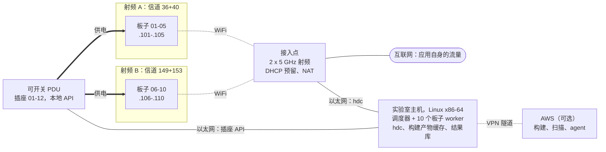

# D600 设备集群方案

*[English](D600-FLEET-PLAN.md)*

十块 D600 开发板接入一个隔离的 WiFi 网络，每块板子配一个可通过 IP 控制通断的电源插座，由一台
Linux 主机统一调度所有板子上的应用启动。目的是让 gap map 得到更多轮验证：完整的 329 个应用一轮，
从单板的 12 小时缩短到 1 小时以内。

状态：提案，2026-10-04。文中数据来自当前这块板子以及 r84、r85 两轮运行（见[实测数据](#实测数据)）。

## 决策

1. **板子通过 WiFi 控制**，接入一个隔离的接入点（两个 5 GHz 射频）。每块板子通过 DHCP 预留获得
   固定地址。
2. **每块板子单独接一个可开关的插座。** D600 拔掉电源就会关机（它的电池是假电池），所以插座断电
   再上电就是一次完整的硬重启。
3. **不再每次启动都重复发送同样的 208 MB**（工作项 S1）。这能消除 WiFi 与 USB 之间大部分的速度
   差距。
4. **用原生 Linux x86-64 主机驱动板子**，不再用 WSL。构建以后可以迁到 AWS。
5. **先在两块板子上验证。** 试点各项关卡通过后再采购另外八块。

**为什么不用 USB。** 板子唯一的 USB-C 口同时负责供电和数据。接在 USB 集线器上时，每个端口都得能给
板子供电并且能单独通断，才能保留逐板重启；而插座断电会让整个集线器上的板子一起重启。如果试点中
WiFi 不达标，再退回 USB 方案。

## 预期吞吐

每一列在前一列的基础上增加一项改动。

| | 现在 | + 输入缓存 (S1) | + Linux 主机 (S3) | 10 块板子 |
|---|---:|---:|---:|---:|
| 每次启动耗时 | ~131 s | ~96 s | ~82 s | 每块 ~82–85 s |
| 每小时启动次数 | 27 | 37 | 44 | ~420 |
| 完整 329 个应用一轮 | 11.9 h | 8.8 h | 7.5 h | ~45–50 分钟 |

每次启动中固定的 45 s 观察等待（12 + 30 + 3 s）保持不变，因为它们本身就是 harness 观察的一部分。
做完 S1 后，十块板子对 WiFi 的总需求约 5–6 MB/s；对这类单天线客户端，一个 40 MHz 信道大约能承载
12–17 MB/s。没有 S1，需求约 16 MB/s，会把一个信道占满。

## 拓扑

板子 01–05 用射频 A，06–10 用射频 B，这样一个射频出故障只会停掉一半的板子。hdc 流量留在实验室
局域网内，应用自身的流量经接入点的 NAT 出去。地址只是私有网段里的示例。

## 硬件

先采购试点所需：接入点、一个 PDU、实验室主机，以及再一块 D600 和它的充电器。

| 项目 | 数量 | 要求 | 原因 |
|---|---:|---|---|
| D600 开发板 | 10 + 1 备用 | 与当前板子相同的 OpenHarmony 镜像，当前板子作为参照 | 每次启动都会对 47 个系统库做哈希校验，固件不同的板子会被拒绝 |
| USB-C PD 充电器 | 11 | 与现用型号相同；5 V / 3 A 或以上 | 板子唯一的供电输入 |
| USB-C 线 | 11 + 备用 | 短线，额定 3 A | 线材太差会让没有真电池的板子掉电 |
| 可开关 PDU 或 IP 电源插排 | 12 个以上插座 | 每个插座可单独开关；本地 HTTP、SNMP 或 SSH API，不依赖云账号；插座间距放得下插头式充电器（两个 8 口的也可以） | 逐板硬重启 |
| 接入点 / 路由器 | 1 | 两个独立的 5 GHz 射频（三频），或两个双频 AP；固定信道；DHCP 预留；NAT 上联；有线局域网口 | 隔离网络，两个信道 |
| 实验室主机 | 1 | Linux x86-64，千兆以太网。构建放 AWS：8 核、32 GB 内存、1 TB NVMe。构建在本地：16 核以上、128 GB 内存、2 TB NVMe | 工具链（OH SDK clang、主机端 dex2oat、Linux hdc）都是 x86-64 Linux |
| 小型千兆交换机 | 1 | 仅当 AP 的局域网口不够时需要 | 主机、PDU 和 AP 在同一个有线局域网 |
| 架子和风扇 | 1 | 板子之间留间距，持续通风 | 板子整天亮屏运行；发热会改变启动耗时 |
| UPS（可选） | 1 | 约 200 W，供主机、AP、PDU 和板子 | 没有真电池，一次电源闪断会让十块板子同时重启 |

## 网络与地址

| 设备 | 地址（示例） | 连接 | 如何固定 |
|---|---|---|---|
| 接入点 / 网关 | 192.168.60.1 | — | 静态；为实验室提供 DHCP |
| 实验室主机 | 192.168.60.10 | 以太网 | 静态 |
| PDU 1 / PDU 2 | .11 / .12 | 以太网 | 静态；插座 01–08 和 09–16 |
| 板子 01–05 | .101–.105 | 射频 A，信道 36+40 | 按 WiFi MAC 做 DHCP 预留；插座编号 = 板子编号 |
| 板子 06–10 | .106–.110 | 射频 B，信道 149+153 | 同上 |
| 备用板子 | .111+ | 任一射频 | 同上 |

接入点设置：

- 每个 5 GHz 射频一个 SSID，让每块板子始终连在同一个信道上。关闭频段引导和漫游类功能。
- 固定 40 MHz 信道，避开雷达检测（DFS）范围：36+40 和 149+153。板子的国家码 CN 允许这两组。
  DFS 信道上一旦检测到雷达就会被迫换信道，该信道上的所有板子都会掉线。
- 试点时试一下 80 MHz。只有当板子的链路速率因此高于现在的 200 Mbit/s 时才保留。
- WPA2 或 WPA3 个人版。这些 SSID 不开 2.4 GHz。
- 按 MAC 做 DHCP 预留，租期设长。如果 OpenHarmony 对该网络使用随机 MAC，把该网络改成设备 MAC，
  或在板子上设静态 IP。
- 有线连接的实验室主机必须能访问每块板子。板子之间不需要互通。
- 通过 NAT 上联互联网，供应用自身的流量使用。不要把实验室网段暴露给办公网络。
- 每块板子的 hdc TCP 端口相同，只有地址不同。

## 电源控制

- 每个板子充电器一个插座，插座编号等于板子编号。板子、充电器和线的两端都贴标签。
- 实验室主机、AP、交换机以及 PDU 本身接在不受控的电源或 UPS 上。自动化流程永远不去控制给它自己
  网络路径供电的插座。
- 硬重启就是插座断电至少 10 s 再上电。板子随后启动、重新连上 WiFi、回到 hdc。
- 只要 hdc 还能响应，就先通过 hdc 重启。断电只用于无响应的板子，因为写入过程中断电可能损坏板子的
  `/data`。
- **试点关卡：** 来电后板子必须自己启动，不需要按键。如果做不到，解决办法是在电源键上接继电器，或
  使用厂商的启动设置。

## 实验室主机与 AWS

实验室主机：

- 原生 Linux（Ubuntu LTS 版本），x86-64，有线接入实验室局域网。
- 使用 OH SDK 中的 Linux hdc（3.2.0c 版）。先在板子上测试：现在用的 Windows 客户端是 2.0.0a。
- 运行调度器、十个板子 worker、构建产物缓存（framework stage、shim、override、约 11 GB 的 APK 输入）、
  结果库和 harness。
- 它取代用 WSL 控制板子的方式：每次 hdc 调用省掉约 146 ms，不再需要文件接收的 Windows 路径变通办法，
  也不再有 interop 掉线和机器检查（MCE）崩溃。

AWS（获批后）：

- 一台 x86-64 实例（c7i 或 c7a 系列）：32–64 vCPU、128 GB 内存、1–2 TB 磁盘。一次性的大构建用
  Spot 实例。
- 使用与当前构建主机相同的源码绝对路径。已记录的构建命令和 natives 构建都依赖这个路径。
- 一次性同步约 37 GB：workspace、构建产物、corpus APK。APK 放在私有存储桶里。私有仓库需要部署密钥。
- 构建产物每次构建只下载一次到实验室主机。结果持续上传，每次启动几 MB。使用 WireGuard 或
  Tailscale 隧道。
- 迁移构建之前，先证明服务器的构建结果一致：重新构建 shim 和 framework jar，与本地构建比较 SHA-256。
- Agent 运行在队列和结果库旁边：起初在实验室主机上，构建迁到 AWS 后再放到 AWS。

## 软件工作

S1 和 S2 在 r85 结束后开始，因为运行期间不修改启动脚本。

| ID | 改动 | 收益 | 工作量 | 依赖 |
|---|---|---|---|---|
| S1 | 在每块板子上用按内容寻址的缓存保存 WebView 文件（185 MB）和运行时库 override（23 MB），每次启动在板子上复制进去。启动清理不动缓存，磁盘守卫清理旧条目。启动时仍校验每个文件的哈希。 | 每次启动 −30–35 s；十块板子的 WiFi 需求从 ~16 降到 ~5–6 MB/s | 0.5–1 天 | r85 结束 |
| S2 | 按板子隔离：用每块板子自己的暂存目录代替固定的 `rg.jpeg`、`ev.*` 和 `ev-libs.tar` 路径；输出目录和日志带板子 ID；用每块板子的锁代替 `pgrep` 等待；板子配置从清单读取。 | 并行运行互不冲突 | 1 天 | — |
| S3 | 改用 Linux hdc。去掉 `hdc.exe`、Windows 路径的文件接收和 WSL interop 重试。 | 每次启动 −14 s | 0.5 天 | 实验室主机 |
| S4 | 设备清单（`fleet.json`）、PDU 驱动、健康检查和[恢复阶梯](#恢复阶梯)。 | 无需人工的恢复 | 1–1.5 天 | PDU 型号 |
| S5 | 调度器和结果库：带分道和优先级的 SQLite 任务队列；每块板子一个 worker。基础设施故障在另一块板子上重新排队，绝不记成应用结果。结果不可变，以应用、配置哈希、板子和轮次为键。 | 十块板子作为一个整体工作 | 2–3 天 | S2、S4 |
| S6 | 多板部署：只构建一次，把每次构建约 68 MB 的增量并行推到每块板子，每块板子上保留当前提升的构建和一两个候选构建。 | 新构建几分钟内上到所有板子 | 0.5–1 天 | S5 |
| S7 | 一致性与漂移检查：配置时和每晚做固件指纹；每轮在每块板子上跑约 30 个应用的校准集；标出结果有偏差的板子；harness 记录里带板子 ID。 | 板子之间的差异不会被当成应用结果 | 1 天 | S5 |
| S8 | 带租约的发现台账；在调度器之上运行一个协调 agent 和 3–5 个调查 agent。 | 并行调查且不重复 | 2 天 | S5、S7 |
| S9 | AWS 初始化脚本和一致性检查。 | 构建和扫描移出实验室主机 | 1 天 + 同步 | AWS 权限 |

## 阶段与关卡

### 阶段 0：准备（到试点硬件到货为止）

- 采购试点硬件：接入点、一个 PDU、实验室主机、一块带充电器的 D600。
- 在 r85 运行期间，在分支上开发 S1 和 S2。
- r85 之后，在 20 个 r85 应用上 A/B 测试 S1。结果和启动时间必须一致；每次启动应缩短约 30 s。

### 阶段 1：两块板子试点（约 1 周）

当前这块板子加一块新板子，接入新网络和 PDU，由新主机驱动。

| 关卡 | 通过条件 |
|---|---|
| P1 网络 | 两块板子都能入网；三次断电重启后预留地址和 MAC 保持不变。 |
| P2 电源 | 每块板子 20 次 PDU 断电重启：20 次都无需按键自动恢复。记录到 hdc 可用的时间，必须在 3 分钟以内。 |
| P3 链路 | 单板时 200 MB 的 hdc 推送不低于 5 MB/s，两块板子同时推送时每块不低于 4 MB/s。比较 40 和 80 MHz。 |
| P4 工具 | Linux hdc 能在这些板子上正常工作，包括两路同时传输。S3 和 S4 合入。 |
| P5 浸泡 | 用 S1–S5 在两块板子上分摊跑一轮 329 个应用。每块板子每 12 小时最多掉线一次 hdc，且都能自动恢复。至少 95% 的应用得到与 r85 相同的生命周期分类，其余都有解释。没有基础设施故障被记成应用结果。 |

决定：所有关卡都通过，就采购第 3–10 块板子。如果 P5 因 WiFi 掉线不通过，改用
[风险与备用方案](#风险与备用方案)中的 USB 备用方案，然后重跑 P5。

### 阶段 2：扩展到十块（板子到货后约 1 周）

- 按下面的[配置清单](#板子配置)配置第 03–10 块板子。
- 把当前提升的构建部署到所有板子（S6），在每块板子上跑校准集（S7）。
- 24 小时老化：在全部十块板子上跑两轮完整测试，然后比较各板子的结果。
- 关卡：每块板子在校准集上与参照板一致；一轮在一小时内完成；没有板子需要人工处理。

### 阶段 3：运行

- 一个共享队列上的分道：canary 1 块，回归 3 块（夜间全部十块），灰盒探针 3 块，调查 3 块。空闲的
  板子从其他分道取任务。
- 一个当前提升的配置。候选配置与它只差一处改动。
- 协调和调查 agent（S8）。AWS 构建（S9）获批后进行。
- 一旦差分探针要排队等那台唯一的 Android 手机，就再加一台 Android 基准设备，或缓存基准设备的答案。

## 板子配置

每块新板子按此顺序做一次：

1. 给板子、充电器和线贴上编号（01–10）。在 `fleet.json` 中记录序列号和 WiFi MAC。
2. 刷入参照板的 OpenHarmony 镜像。确认 47 个库的固件指纹一致。
3. 打开开发者模式和 hdc。设置统一的 hdc TCP 端口。确认 `persist.hdc.mode=tcp` 和端口在断电重启后
   保持不变；当前板子是保持的。
4. 用设备 MAC 加入该板子的 SSID（01–05 用射频 A，06–10 用射频 B）。确认它拿到预留地址。
5. 从实验室主机用 `hdc tconn <地址>:<端口>` 连接。如果板子要求授权主机，接受一次。
6. 安装 Westlake 宿主应用：与参照板上相同的签名包。
7. 把充电器插到该板子的插座上。做三次 PDU 断电重启，确认每次都能自己恢复。
8. 部署当前提升的 framework stage 和输入缓存（S6、S1）。运行 framework 契约探针，必须通过。
9. 跑校准集，与参照板比较，然后把板子标记为可用。

## 恢复阶梯

每个板子 worker 自己逐级执行。当时正在运行的任务会在另一块板子上重新排队，绝不算作应用结果。

| 步骤 | 触发条件 | 动作 |
|---:|---|---|
| 1 | 板子不在 `hdc list targets` 中，或命令超时 | 对该板子 `hdc tconn`，等 20 s，再检查 |
| 2 | 所有板子同时掉线 | 重启主机上的 hdc server，再检查 |
| 3 | 能连上但卡住：shell 挂起、`appspawn-x` 起不来，或屏幕唤不醒 | `hdc shell reboot`，等板子恢复 |
| 4 | 第 1–2 步之后仍然连不上 | 插座断电 10 s 再上电；等待启动、WiFi 和 hdc |
| 5 | 一小时内三次硬重启都失败 | 隔离该板子，把它的任务移到其他板子，标记待人工处理 |

每次重启后：重新设置屏幕超时覆盖和电源模式，唤醒并解锁屏幕，运行磁盘守卫，检查 framework stage
的哈希，并读取板子温度（过热的板子先等待再接任务）。

## 日常运行

| 时间 | 运行内容 |
|---|---|
| 持续 | 各分道取任务。新的阻塞签名进入发现台账，由调查 agent 租用处理。 |
| 每个候选构建 | 在一块板子上跑约 30 个应用的 canary，同时跑当前提升构建的对照。只有 canary 通过、且最近一轮完整测试没有回归时，才提升该构建。 |
| 每晚 | 在全部十块板子上跑一轮完整测试（约 45–50 分钟），每块板子跑校准集，并为 harness 生成盲测评分报告。 |
| 每周 | 按产出重新平衡分道。审计固件和板子一致性。检查每块板子 `/data` 的剩余空间。复查被隔离的板子。 |

## 风险与备用方案

| 风险 | 表现 | 应对 |
|---|---|---|
| WiFi 掉线 | 试点中每块板子每 12 小时掉线不止一次，或掉线集中出现 | 单次掉线由恢复阶梯处理。如果 P5 不通过，改用 USB 备用方案：集线器每个端口带数据提供 3 A，并可单独开关供电，作为逐板重启手段（PDU 则用于重启整个集线器）。先测量一块板子的峰值功耗。 |
| 来电后不开机 | P2 不通过 | 在电源键上接继电器，或使用厂商的启动设置 |
| 固件漂移 | 启动因 "Host firmware differs" 停止 | 重新刷参照镜像。配置时和每晚做指纹检查。 |
| 板子之间的差异 | 校准集结果不一致 | 不一致的结果先在另一块板子上重跑再计入。隔离异常板子。 |
| 断电损坏 `/data` | 板子无法启动或报文件系统错误 | 先用 hdc 重启；只在无响应时断电。从镜像重刷。 |
| 发热 | 板子温度上升，启动变慢 | 留间距、加风扇，健康检查中读取温度 |
| 板子 `/data` 写满 | 磁盘守卫停止启动 | 现有的每次启动检查，加上缓存清理 |
| AP 或射频故障 | 一半板子同时掉线 | 两个射频限制影响范围。备份 AP 配置；准备一台备用 AP。 |
| 实验室主机故障 | 所有板子空闲 | 主机配置放在 git 里，可以重建；每晚备份结果库 |

## 待定输入

1. 批准拓扑方案（WiFi 加每块板子一个可开关插座，USB 作为备用）和试点硬件采购。
2. 参照板的 OpenHarmony 镜像和刷机工具，供新板子使用。
3. IT 批准一个带互联网上联的隔离接入点，以及远程访问实验室主机的方式。
4. PDU 型号，用于编写它的 API 驱动。
5. 同意在 r85 之后修改启动脚本（S1、S2）。
6. 可选：一个 AWS 账号或实例，用于 S9。

## 实测数据

2026-10-04 在当前板子以及 r84、r85 两轮运行上测得，只用只读命令和被动计时。

| 项目 | 实测 |
|---|---|
| 启动耗时 | r84：329 次启动用时 11.94 h，每次约 131 s。暂存和启动约 67 s；证据采集约 64 s，其中 45 s 是固定等待。 |
| 启动归档推送 | 每次启动 37–54 s，速率 5.3–6.4 MB/s，在五次 r85 启动上计时。 |
| 归档内容 | 约 215 MB：WebView 文件 185 MB 和运行时 override 23 MB，每次启动都相同，另加应用自己的文件。在 335 个准备好的应用中，应用文件中位数 19 MB，平均 48 MB，p90 118 MB，最大 773 MB。 |
| hdc 调用 | 每次启动约 103 次。每次约 159 ms：其中 146 ms 是 WSL 启动 Windows hdc 客户端，约 13 ms 是 WiFi 加板子本身。Ping 3–12 ms，平均 5.8 ms。 |
| 板子 WiFi | 5 GHz 信道 40，单天线，链路 200 Mbit/s，−56 dBm，国家码 CN。 |
| 板子供电与 USB | 一个 USB-C 口：供电输入（PD，目前 5 V / 3 A）以及支持 USB 3.2 的设备端口。电池是假电池，拔掉电源就关机。 |
| Framework stage | 460 个文件共 491 MB。从构建 84 到 85，有 9 个文件、68 MB 变化。 |
| 固件检查 | 每次启动对 47 个系统库做哈希校验。 |
| 以往 WiFi 掉线 | 2026-09-28，一次无线 hdc 掉线让 128 次启动同时失败。板子并没有重启，`hdc tconn` 就恢复了。 |
| hdc 版本 | OH SDK 中的 Linux 客户端：3.2.0c。目前使用的 Windows 客户端：2.0.0a。 |
